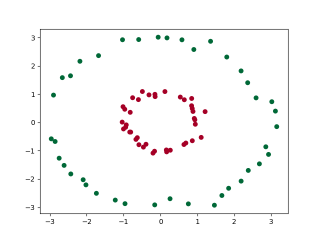
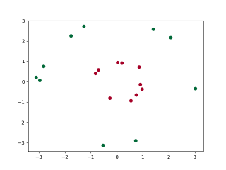
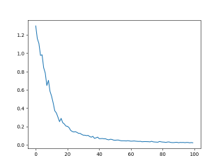
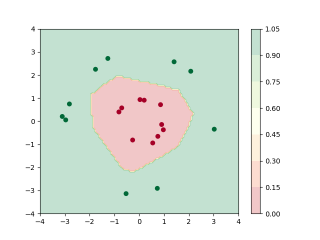

# CraftDL

## What is this?

`CraftDL` is a library for quickly solving simple & common deep learning tasks.

## Requirements

You will need `Python >= 3.9` and some recent version of `pip` (e.g. `pip >= 20.0`) 
to use this library.

## Installation

You can install CraftDL using the pip package manager:

```shell
pip install craftdl
```

## Basic example

Here is an example for how you might want to use `CraftDL`:

```python
from craftdl import *

# Obtain the dataset
inputs, targets = circles_dataset(rs=[1, 3], ns=[50, 50])

# Create a train-test split
(inputs_train, targets_train), (inputs_test, targets_test) = train_test_split(inputs, targets)

# Plot the train and test datasets
plot_labels(inputs_train, targets_train)
plot_labels(inputs_test, targets_test)

# Create and fit a LinearClassificationNet
model = LinearClassificationNet(2, [6], 1)
losses = model.fit(inputs_train, targets_train, 100, lr=1.0)

# Plot the losses
plot_losses(losses)

# Get the accuracy on the test dataset
accuracy = model.accuracy(inputs_test, targets_test)
print(f"accuracy on test set={accuracy}")

# Get the predictions on the test dataset
predictions_test = model.predict(inputs_test)

# Show the decision boundary
x1_grid, x2_grid, predictions_grid = model.predict_grid(-4, 4, -4, 4)
plot_labels_with_decision_surface(
    inputs_test, targets_test, x1_grid, x2_grid, predictions_grid
)
```

You should get a bunch of images along with a low loss and a high accuracy on the test set.

The training dataset:



The testing dataset:



The loss plot:



The decision surface:



## Matplotlib backend for plotting

The plotting facilities of CraftDL are built on top of `matplotlib`. Therefore you need
an appropriate `matplotlib` backend. If you encounter weird `matplotlib` errors when
trying to call a plotting function, you most probably don't have the appropriate backend
installed on selected.

Usually you want to use the `TkAgg` backend. You can use it like this:

```python
import matplotlib
matplotlib.use("TkAgg")
```
